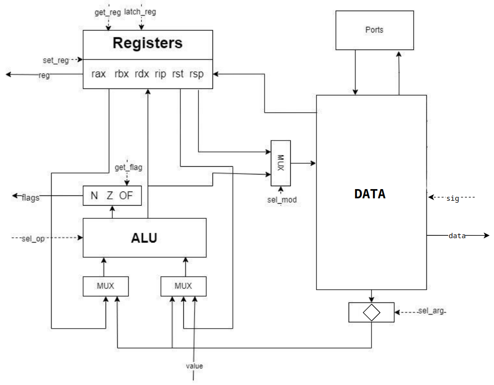
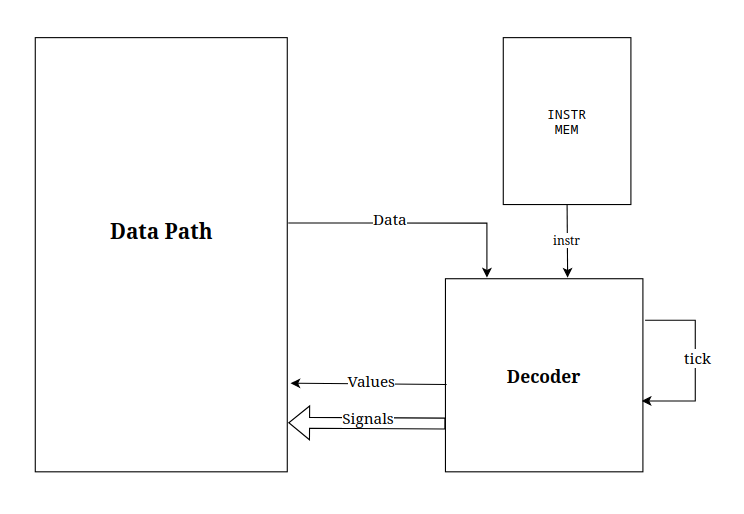

Assembler. Транслятор и модель
==============================
- P33102, Жданок Прокопий Александрович.
- asm | cisc | neum | hw | instr | binary | trap | port | pstr | prob1 | spi
- Без усложнения

## Язык программирования

### Синтаксис

**Форма Бэкуса-Наура:**

```ebnf
<program>       ::= <section_text> | <section_data> <section_text>

<section_data>  ::= "section .data" <new_line> <data>
<data>          ::= <data_line> | <data_line> <data> | <data_line> <data> <comment>
<data_line>     ::= <var_name> ":" <var_value> | <var_name> ":" <var_name>
<var_name>      ::= <word>
<var_value>     ::= <string> | <number> | <buffer>
<string>        ::= "'" <word> "'" | "\"" <word> "\""
<buffer>        ::= "buf " <number> | "buf " <number> <number>

<section_text>  ::= "section .text" <new_line> <instructions>
<instructions>  ::= <instruction> | <instruction> <instructions>
<instruction>   ::= <command> | <label> ":" <command> | <command> <comment>
<command>       ::= <word> | <word> <operands>
<operands>      ::= <operand> | <operand> <operands>
<operand>       ::= <number> | <label> | <registor> | <var> | <port>
<label>         ::= "." <word>
<registor>      ::= "%" <word>
<var>           ::= "#" <word> | "*" <word> | <word> "[" <number> "]"
<port>          ::= "!" <number>

<comment>       ::= ";" <text>
<text>          ::= <word> | <word> <text>
<word>          ::= <letter_or_digit> | <letter_or_digit> <word>
<letter_or_digit>  ::= <letter> | <digit>
<new_line>      ::= "\n" 
<letter>        ::= [a-z] | [A-Z]
<number>        ::= <digit> | <digit> <number>
<digit>         ::= [0-9]
```
Код выполняется последовательно и разделен на две секции: секцию с переменными и секцию кода.

В секции переменных (заголовок "section .data") объявляются переменные трех типов: строки, числа и массивы.

В секции кода (заголовок "section .text") написана программа с использованием меток и команд. Некоторые команды могут принимать неограниченное количество аргументов, которые могут быть числами (непосредственная передача), ссылками на память (прямая адресация, обозначается символом "#", или косвенная адресация, обозначается символом "*"), регистрами (обозначается символом "%") или номерами портов (обозначается символом "!").
Код поддерживает метки и комментарии (объявляются после символа ";") и имеет статическую, слабую типизацию.

## Организация памяти 

Фон Неймановская архитектура.

Память команд и данныx - общая 

Размер машинного слова - `80` бит

Память содержит `2^11` ячеек

Память представляет из себя четыре секции:

```text
    +-----------------+
    |   JMP_TO_START  |
    |   JMP_TO_INT    |
    +-----------------+
    |      DATA       |
    |                 |
    |                 |
    |                 |
    +-----------------+
    |      CODE       |
    |                 |
    |                 |
    |                 |
    +-----------------+
            ...
    +-----------------+
    |      STACK      |
    |                 |
    |                 |
    +-----------------+
```

* `JMP_TO_START` - храниться адрес первой команды из секции `CODE`.
* `JMP_TO_INT` - переменная в которой, храниться адрес первой команды, которая выполнится при вызове прерывании 

* `DATA` - раздел, в котором хранятся переменные, строки и массивы, созданные в секции "section .data" подряд в том же порядке, в котором они перечислены в коде.

* `CODE` - раздел, в котором хранятся инструкции, описанные в секции "section .text".

* `STACK` - раздел, в котором сохраняются данные при вызове прерывания. 


В процессоре расположено 6 регистров.
Размер регистра - 32 бита.
* `rax` - регистр общего назначения, сохраняется на стэк при прерывании
* `rbx` - регистр общего назначения
* `rdx` - регистр общего назначения
* `rip` - регистр текущей инструкции, сохраняется на стэк при прерывании
* `rst` - регистр хранящий состояние прерывания
* `rsp` - указатель стека

Присутствует три флага состояния на выходах АЛУ - Zero Flag, Negative Flag и Overflow Flag 

### Организация ввода-вывода.
Ввод вывод с помощью прерываний. Когда поступают входные данные, Instruction Pointer сохраняется на стэк вместе с регистром rax, далее он перемещается на специальный адрес #INT(который пользователь устанавливает сам), 
начиная с которого последовательно выполняются все инструкции обработчика прерываний. Затем происходит
возврат из прерывания(IRET), Instruction Pointer восстанавливается в искомое положение.

Прерывания запрещаются автоматически во время выполнения прерывания. По умолчанию прерывания запрещены, их можно включить и отключить вручную командами EI, DI. Если прерывание возникает, но они запрещены, то оно попадает в очередь прерываний.

## Система команд

Особенности процессора:

- Машинное слово -- `80` бита.
- Числа `32` бит, знаковые.

Каждая команда выполняется в несколько циклов:

1. Цикл выборки команды
2. Цикл выборки операнда и исполнения
3. Цикл прерывания(проверяется, не произошел ли запрос на прерывание)

Некоторые инструкции могут принимать три операнда. В таком случае при трансляции сложная инструкция преобразуется в две простых.

``` asm
add %rax #var1              ; %rax + #var1           -> %rax
add %rax #var1 #var2        ; (%rax + #var1) + #var2 -> %rax
```

### Набор инструкций

| Syntax | Code | Mnemonic     | Comment                                          |
|:-------|------|:-------------|:-------------------------------------------------|
| `NOP`  | 00   | nothing      | Отсутствие операции                              |
| `ADD`  | 01   | summary      | Сложение операндов и сохранение                  |
| `SUB`  | 02   | subtract     | Вычитание операндов и сохранение                 |
| `MUL`  | 03   | multiply     | Умножение операндов и сохранение                 |
| `DIV`  | 04   | divide       | Деление операндов и сохранение                   |
| `MOD`  | 05   | mod_div      | Получение остатка от деления и сохранение        |
| `XOR`  | 06   | xor          | Логическое исключающее "ИЛИ" и сохранение        |
| `AND`  | 07   | and          | Логическое "И" и сохранение                      |
| `OR`   | 08   | or           | Логическое "ИЛИ" и сохранение                    |
| `CMP`  | 09   | compare      | Вычитание операндов и установка флагов           |
| `MOV`  | 0A   | move         | Передать значение из операнда в операнд          |
| `MOVI` | 0B   | move in      | Передать значение из порта в операнд             |
| `MOVO` | 0C   | move out     | Передать значение из операнда в порт             |
| `JMP`  | 0D   | jmp          | Безусловный переход к метке                      |
| `JZ`   | 0E   | jmp zero     | Переход, если равенство (Z=1)                    |
| `JNZ`  | 0F   | jmp not zero | Переход, если не равенство (Z=0)                 |
| `JN`   | 10   | jmp negative | Переход, если меньше (N=1)                       |
| `JP`   | 11   | jmp positive | Переход, если больше или равно (N=0)             |
| `IRET` | 12   | iret         | Возврат из прерывания                            |
| `DI`   | 13   | di           | Запрет прерываний                                |
| `EI`   | 14   | ei           | Разрешение прерываний                            |
| `HLT`  | 15   | halt         | Остановка программы                              |

### Кодирование инструкций

Инструкция состоят из 80 бит и разделена на 5 частей:

- 8 бит - код инструкции
- 4 бита - тип адресации
  - 0000 - константа
  - 0001 - регистр
  - 0010 - адрес
  - 0011 - порт
  - 0100 - косвенный адрес
- 32 бита - значение, знаковое число, находящиеся в диапазоне от $`-2^{31}`$ до $`2^{31}-1`$
- 4 бита - тип адресации
- 32 бита - второе значение, знаковое число, находящиеся в диапазоне от $`-2^{31}`$ до $`2^{31}-1`$

Пример:
``` text
8 0b200000002300000000 movi #2 !0
```

## Транслятор

Интерфейс командной строки: `translator.py <input_file> <target_file>`

Реализовано в модуле: [translator](./translator.py)

Этапы трансляции:

1. Очистка кода от лишних пробелов и комментариев
2. Выделение меток и переменных из кода и замена на абсолютную адресацию
3. Парсинг кода построчно, определение типа команды и тип адресации 
4. Генерация машинного кода в зависимости от типа команды

На вход принимает два файла:
* Файл с программой на языке высокого уровня.
* Путь к файлу, в который будет записана программа в машинных словах

## Пример использования языка

Программа:
``` asm
section .data
      var1: -10                                   ; создается переменная var1 со значением -10
      var2: 5                                     ; создается переменная var2 со значением 5
      buf1: buf 20 2                              ; создается массив длины 20 каждая ячейка которого заполняется значением 2
      name: "Hello"                               ; создается массив первый элемент это длина строки, а дальше идут коды символов
      index: name                                 ; создается ссылка на адрес начала массива name
  section .text
      mov %rax *index                             ; записывает в регистр rax значение, которое лежит по адресу index(длину строки)
      add #index 1
      .loop: add buf1[1] name[0] #var1 *index     ; устанавливается метка
                                                  ; затем складывается второе значение из массива buf1 с длиной строки name
                                                  ; дальше добавляется значение переменной var1
                                                  ; и добавляется значение, которое лежит по адресу index
                                                  ; сохраняет получившийся результат во вторую ячейку массива buf1
      movo !1 *index                              ; выводит букву на которую указывает index
      add #index 1                                ; добавляет к переменной единицу index и сохраняет ответ в index
      sub #var2 1                                 ; вычитает из переменной var2 единицу и сохраняет ответ в var2
      jnz .loop                                   ; если не установлен флаг Z, то перейти по метке loop
      hlt           
```
Трансляция:
```text
  0 0000000001f000000000 31
  1 00000000000000000000 0
  2 000fffffff6000000000 -10
  3 00000000005000000000 5
  4 00000000002000000000 2
  5 00000000002000000000 2
  6 00000000002000000000 2
  7 00000000002000000000 2
  8 00000000002000000000 2
  9 00000000002000000000 2
  10 00000000002000000000 2
  11 00000000002000000000 2
  12 00000000002000000000 2
  13 00000000002000000000 2
  14 00000000002000000000 2
  15 00000000002000000000 2
  16 00000000002000000000 2
  17 00000000002000000000 2
  18 00000000002000000000 2
  19 00000000002000000000 2
  20 00000000002000000000 2
  21 00000000002000000000 2
  22 00000000002000000000 2
  23 00000000002000000000 2
  24 00000000005000000000 5
  25 00000000048000000000 72
  26 00000000065000000000 101
  27 0000000006c000000000 108
  28 0000000006c000000000 108
  29 0000000006f000000000 111
  30 00000000018000000000 24
  31 0a10000000040000001e mov %rax *30
  32 0120000001e000000001 add #30 1
  33 01200000005200000018 add #5 #24
  34 01200000005200000002 add #5 #2
  35 0120000000540000001e add #5 *30
  36 0c30000000140000001e movo !1 *30
  37 0120000001e000000001 add #30 1
  38 02200000003000000001 sub #3 1
  39 0f000000021000000000 jnz 33
  40 15000000000000000000 hlt
```

Лог работы процессора:
``` text
  INFO    machine:command_cycle Tick: 0 | Registers: rax: 0, rbx: 0, rdx: 0, rip: 31, rst: 0, rsp: 2047 Flags: N: 0 Z: 1 OF: 0 | Instruction: nop
  INFO    machine:command_cycle Tick: 2 | Registers: rax: 5, rbx: 0, rdx: 0, rip: 32, rst: 0, rsp: 2047 Flags: N: 0 Z: 0 OF: 0 | Instruction: mov %rax *30
  INFO    machine:command_cycle Tick: 6 | Registers: rax: 5, rbx: 0, rdx: 0, rip: 33, rst: 0, rsp: 2047 Flags: N: 0 Z: 0 OF: 0 | Instruction: add #30 1
  INFO    machine:command_cycle Tick: 10 | Registers: rax: 5, rbx: 0, rdx: 0, rip: 34, rst: 0, rsp: 2047 Flags: N: 0 Z: 0 OF: 0 | Instruction: add #5 #24
  INFO    machine:command_cycle Tick: 14 | Registers: rax: 5, rbx: 0, rdx: 0, rip: 35, rst: 0, rsp: 2047 Flags: N: 1 Z: 0 OF: 0 | Instruction: add #5 #2
  INFO    machine:command_cycle Tick: 18 | Registers: rax: 5, rbx: 0, rdx: 0, rip: 36, rst: 0, rsp: 2047 Flags: N: 0 Z: 0 OF: 0 | Instruction: add #5 *30
  INFO    machine:wr_port       OUTPUT: [] <- H
  INFO    machine:command_cycle Tick: 20 | Registers: rax: 5, rbx: 0, rdx: 0, rip: 37, rst: 0, rsp: 2047 Flags: N: 0 Z: 0 OF: 0 | Instruction: movo !1 *30
  INFO    machine:command_cycle Tick: 24 | Registers: rax: 5, rbx: 0, rdx: 0, rip: 38, rst: 0, rsp: 2047 Flags: N: 0 Z: 0 OF: 0 | Instruction: add #30 1
  INFO    machine:command_cycle Tick: 28 | Registers: rax: 5, rbx: 0, rdx: 0, rip: 39, rst: 0, rsp: 2047 Flags: N: 0 Z: 0 OF: 0 | Instruction: sub #3 1
  INFO    machine:command_cycle Tick: 30 | Registers: rax: 5, rbx: 0, rdx: 0, rip: 33, rst: 0, rsp: 2047 Flags: N: 0 Z: 0 OF: 0 | Instruction: jnz 33
  INFO    machine:command_cycle Tick: 34 | Registers: rax: 5, rbx: 0, rdx: 0, rip: 34, rst: 0, rsp: 2047 Flags: N: 0 Z: 0 OF: 0 | Instruction: add #5 #24
  INFO    machine:command_cycle Tick: 38 | Registers: rax: 5, rbx: 0, rdx: 0, rip: 35, rst: 0, rsp: 2047 Flags: N: 0 Z: 0 OF: 0 | Instruction: add #5 #2
  INFO    machine:command_cycle Tick: 42 | Registers: rax: 5, rbx: 0, rdx: 0, rip: 36, rst: 0, rsp: 2047 Flags: N: 0 Z: 0 OF: 0 | Instruction: add #5 *30
  INFO    machine:wr_port       OUTPUT: ['H'] <- e
  INFO    machine:command_cycle Tick: 44 | Registers: rax: 5, rbx: 0, rdx: 0, rip: 37, rst: 0, rsp: 2047 Flags: N: 0 Z: 0 OF: 0 | Instruction: movo !1 *30
  INFO    machine:command_cycle Tick: 48 | Registers: rax: 5, rbx: 0, rdx: 0, rip: 38, rst: 0, rsp: 2047 Flags: N: 0 Z: 0 OF: 0 | Instruction: add #30 1
  INFO    machine:command_cycle Tick: 52 | Registers: rax: 5, rbx: 0, rdx: 0, rip: 39, rst: 0, rsp: 2047 Flags: N: 0 Z: 0 OF: 0 | Instruction: sub #3 1
  INFO    machine:command_cycle Tick: 54 | Registers: rax: 5, rbx: 0, rdx: 0, rip: 33, rst: 0, rsp: 2047 Flags: N: 0 Z: 0 OF: 0 | Instruction: jnz 33
  INFO    machine:command_cycle Tick: 58 | Registers: rax: 5, rbx: 0, rdx: 0, rip: 34, rst: 0, rsp: 2047 Flags: N: 0 Z: 0 OF: 0 | Instruction: add #5 #24
  INFO    machine:command_cycle Tick: 62 | Registers: rax: 5, rbx: 0, rdx: 0, rip: 35, rst: 0, rsp: 2047 Flags: N: 0 Z: 0 OF: 0 | Instruction: add #5 #2
  INFO    machine:command_cycle Tick: 66 | Registers: rax: 5, rbx: 0, rdx: 0, rip: 36, rst: 0, rsp: 2047 Flags: N: 0 Z: 0 OF: 0 | Instruction: add #5 *30
  INFO    machine:wr_port       OUTPUT: ['H', 'e'] <- l
  INFO    machine:command_cycle Tick: 68 | Registers: rax: 5, rbx: 0, rdx: 0, rip: 37, rst: 0, rsp: 2047 Flags: N: 0 Z: 0 OF: 0 | Instruction: movo !1 *30
  INFO    machine:command_cycle Tick: 72 | Registers: rax: 5, rbx: 0, rdx: 0, rip: 38, rst: 0, rsp: 2047 Flags: N: 0 Z: 0 OF: 0 | Instruction: add #30 1
  INFO    machine:command_cycle Tick: 76 | Registers: rax: 5, rbx: 0, rdx: 0, rip: 39, rst: 0, rsp: 2047 Flags: N: 0 Z: 0 OF: 0 | Instruction: sub #3 1
  INFO    machine:command_cycle Tick: 78 | Registers: rax: 5, rbx: 0, rdx: 0, rip: 33, rst: 0, rsp: 2047 Flags: N: 0 Z: 0 OF: 0 | Instruction: jnz 33
  INFO    machine:command_cycle Tick: 82 | Registers: rax: 5, rbx: 0, rdx: 0, rip: 34, rst: 0, rsp: 2047 Flags: N: 0 Z: 0 OF: 0 | Instruction: add #5 #24
  INFO    machine:command_cycle Tick: 86 | Registers: rax: 5, rbx: 0, rdx: 0, rip: 35, rst: 0, rsp: 2047 Flags: N: 0 Z: 0 OF: 0 | Instruction: add #5 #2
  INFO    machine:command_cycle Tick: 90 | Registers: rax: 5, rbx: 0, rdx: 0, rip: 36, rst: 0, rsp: 2047 Flags: N: 0 Z: 0 OF: 0 | Instruction: add #5 *30
  INFO    machine:wr_port       OUTPUT: ['H', 'e', 'l'] <- l
  INFO    machine:command_cycle Tick: 92 | Registers: rax: 5, rbx: 0, rdx: 0, rip: 37, rst: 0, rsp: 2047 Flags: N: 0 Z: 0 OF: 0 | Instruction: movo !1 *30
  INFO    machine:command_cycle Tick: 96 | Registers: rax: 5, rbx: 0, rdx: 0, rip: 38, rst: 0, rsp: 2047 Flags: N: 0 Z: 0 OF: 0 | Instruction: add #30 1
  INFO    machine:command_cycle Tick: 100 | Registers: rax: 5, rbx: 0, rdx: 0, rip: 39, rst: 0, rsp: 2047 Flags: N: 0 Z: 0 OF: 0 | Instruction: sub #3 1
  INFO    machine:command_cycle Tick: 102 | Registers: rax: 5, rbx: 0, rdx: 0, rip: 33, rst: 0, rsp: 2047 Flags: N: 0 Z: 0 OF: 0 | Instruction: jnz 33
  INFO    machine:command_cycle Tick: 106 | Registers: rax: 5, rbx: 0, rdx: 0, rip: 34, rst: 0, rsp: 2047 Flags: N: 0 Z: 0 OF: 0 | Instruction: add #5 #24
  INFO    machine:command_cycle Tick: 110 | Registers: rax: 5, rbx: 0, rdx: 0, rip: 35, rst: 0, rsp: 2047 Flags: N: 0 Z: 0 OF: 0 | Instruction: add #5 #2
  INFO    machine:command_cycle Tick: 114 | Registers: rax: 5, rbx: 0, rdx: 0, rip: 36, rst: 0, rsp: 2047 Flags: N: 0 Z: 0 OF: 0 | Instruction: add #5 *30
  INFO    machine:wr_port       OUTPUT: ['H', 'e', 'l', 'l'] <- o
  INFO    machine:command_cycle Tick: 116 | Registers: rax: 5, rbx: 0, rdx: 0, rip: 37, rst: 0, rsp: 2047 Flags: N: 0 Z: 0 OF: 0 | Instruction: movo !1 *30
  INFO    machine:command_cycle Tick: 120 | Registers: rax: 5, rbx: 0, rdx: 0, rip: 38, rst: 0, rsp: 2047 Flags: N: 0 Z: 0 OF: 0 | Instruction: add #30 1
  INFO    machine:command_cycle Tick: 124 | Registers: rax: 5, rbx: 0, rdx: 0, rip: 39, rst: 0, rsp: 2047 Flags: N: 0 Z: 1 OF: 0 | Instruction: sub #3 1
  INFO    machine:command_cycle Tick: 126 | Registers: rax: 5, rbx: 0, rdx: 0, rip: 40, rst: 0, rsp: 2047 Flags: N: 0 Z: 1 OF: 0 | Instruction: jnz 33
  INFO    machine:command_cycle Tick: 127 | Registers: rax: 5, rbx: 0, rdx: 0, rip: 40, rst: 0, rsp: 2047 Flags: N: 0 Z: 1 OF: 0 | Instruction: hlt
  INFO    machine:simulation    output_buffer: 'Hello'
```

## Модель процессора
Интерфейс командной строки: `mashine.py <machine_code_file> <input_file>`

Реализовано в модуле: [mashine](./machine.py).

### DataPath

Реализован в классе `DataPath`.



* `get_reg` - передать регистр в CU.
* `set_reg` - выбрать регистр
* `latch_reg` - записать значение в регистр


* `get_flags` - передать значение флага в CU
* `sel_op` - выбор операции
* `value` - значение для записи в регистр из CU


* `set_mod` - воспринимать значение как данные или адрес
* `get_ins` - отправить инструкцию в CU
* `instruction` - инструкция из памяти, которая передается в CU
* `addr` - адрес, по которому надо взять значение при чтении или куда записать
* `sel_arg` - передать дальше первый или второй аргумент

### ControlUnit

Реализован в классе `ControlUnit`.



- Метод `command_cycle`  моделирует выполнение полного цикла команд 
- Метод `decode_and_execute_instruction` моделирует выполнение цикла выборки инструкции,
  операнда и исполнения.
- После завершения цикла исполнения проверяется, не произошел ли запрос прерывания, и разрешены ли прерывания. Если оба
  условия верны, то вызывается метод `execute_interruption`
- В рамках реализованной модели на python существуют счетчик количества инструкций только для наложения ограничения на
  кол-во шагов моделирования

Особенности работы модели:

- Цикл симуляции осуществляется в функции `simulation`.
- Шаг моделирования соответствует одной инструкции с выводом состояния в журнал.
- Для журнала состояний процессора используется стандартный модуль `logging`.
- Количество инструкций для моделирования лимитировано.
- Остановка моделирования осуществляется при:
    - превышении лимита количества выполняемых инструкций;
    - нехватки памяти
    - если выполнена инструкция `hlt`.

## Тестирование

Реализованные програмы

1. [hello world](example/code/hello.myasm): вывести на экран строку `'Hello World!'`
2. [cat](example/code/cat.myasm): программа `cat`, повторяем ввод на выводе.
3. [hello_user_name](example/code/hello_user_name.myasm) -- программа `hello_user_name`: запросить у пользователя его
   имя, считать его, вывести на экран приветствие
4. [prob1](example/code/prob1.myasm): найти сумму всех чисел кратных 3 или 5, не превышающих `1000`.
5. [test](example/code/test.myasm): пример возможностей языка

Интеграционные тесты реализованы тут [integration_test](./test/test_golden.py):

- через golden tests, конфигурация которых лежит в папке [golden](./golden)

CI:

``` yml
name: Python CI

on:
  push:
    branches:
      - master
      - main

jobs:
  csa3:
    runs-on: ubuntu-latest

    steps:
    - name: Checkout code
      uses: actions/checkout@v3

    - name: Set up Python
      uses: actions/setup-python@v3
      with:
        python-version: 3.11

    - name: Install dependencies
      run: |
        python -m pip install --upgrade pip
        pip install poetry
        poetry install

    - name: Run tests and coverage
      run: |
        poetry run pytest --verbose
        poetry run coverage run -m pytest
        poetry run coverage report

    - name: Run mypy checks
      run: poetry run mypy .

    - name: Check code formatting
      run: poetry run ruff format --check .

    - name: Run code linting
      run: |
        poetry run ruff check .
```

## Итог
```text
| ФИО                     | алг              | LoC | code байт | code инстр. | инстр. | такт. | вариант                                                                    |
| Жданок Прокопий Александрович | hello            | 14  | -         | 26          | 73     | 210   | asm | cisc | neum | hw | instr | binary | trap | port | pstr | prob1 | spi |
| Жданок Прокопий Александрович | cat              | 13  | -         | 13          | 46     | 139   | asm | cisc | neum | hw | instr | binary | trap | port | pstr | prob1 | spi |
| Жданок Прокопий Александрович | hello_user_name  | 53  | -         | 95          | 201    | 607   | asm | cisc | neum | hw | instr | binary | trap | port | pstr | prob1 | spi |
| Жданок Прокопий Александрович | prob1            | 37  | -         | 37          | 10124  | 19244 | asm | cisc | neum | hw | instr | binary | trap | port | pstr | prob1 | spi |
```


